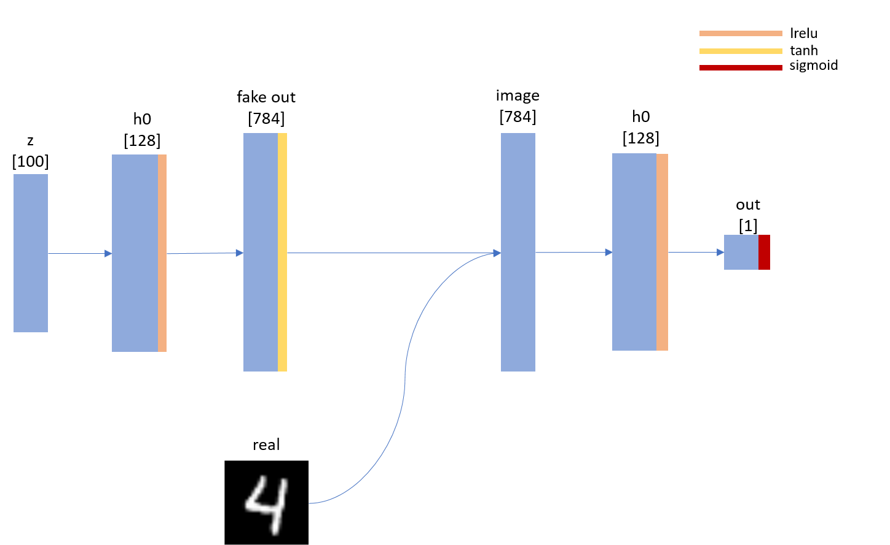
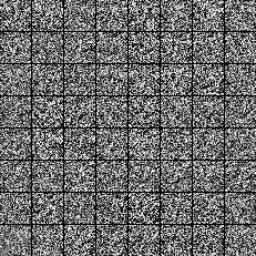
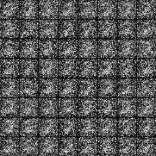
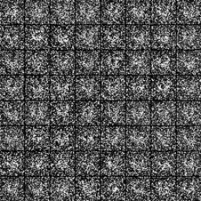
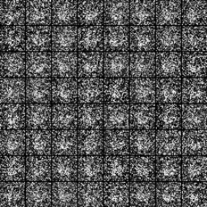
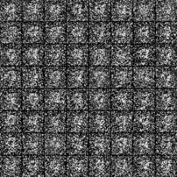

# GAN in Numpy
This is a very simple step by step implementation of GAN using only numpy.  
Without the use of GPU, it takes too much time to generate all the numbers.  
Therefore, to see the result quickly using only CPU, I suggest working with one number in MNIST dataset.  

### What you can find
* Vanilla GAN
* Xavier Initialization
* Instance Norm
* SGD

### Prerequisites  
* Numpy  
* Opencv/PIL (to visualize/save results)  

## Network  

## Results

## Author  
Seung Shin / [@shinseung428](http://shinseung428.github.io)