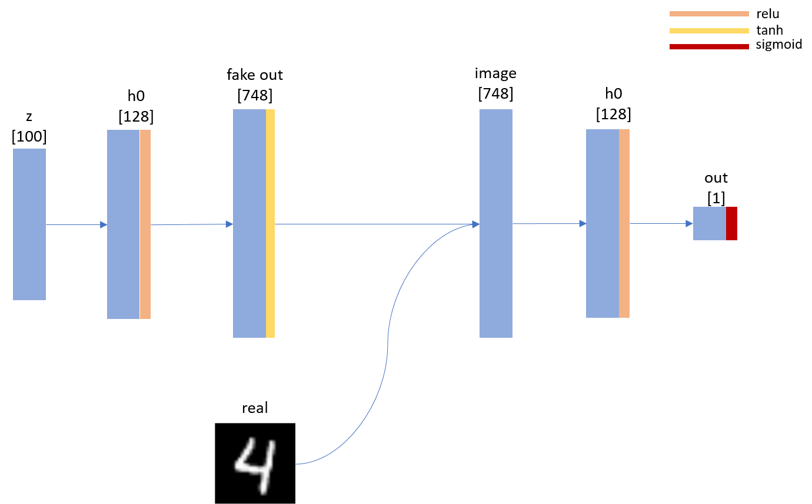

# GAN in Numpy
This is a very simple step by step implementation of GAN using only numpy.  

### What you can find
* Vanilla GAN
* Xavier Initialization
* Adam Optimizer
* Instance Norm

### Prerequisites  
* numpy  
* PIL/opencv (to visualize/save results)  

## Network  

## Results

## Author  
Seung Shin / [@shinseung428](http://shinseung428.github.io)